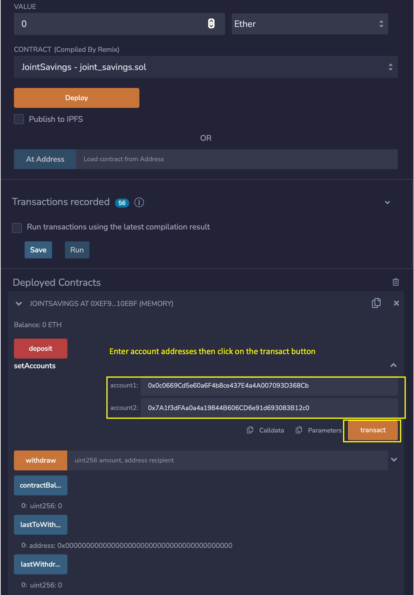
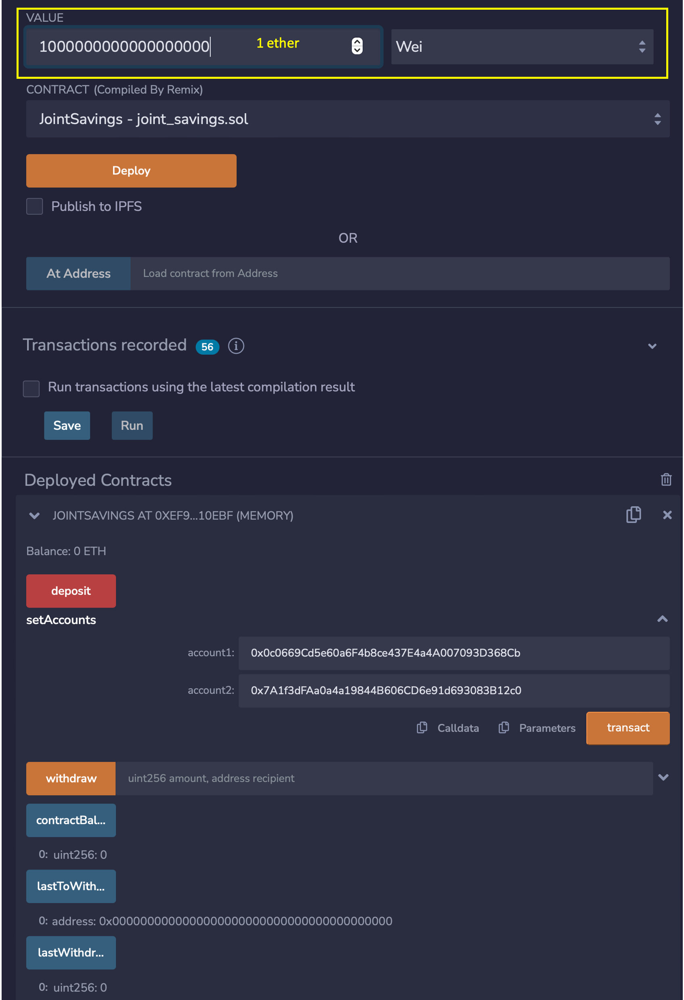
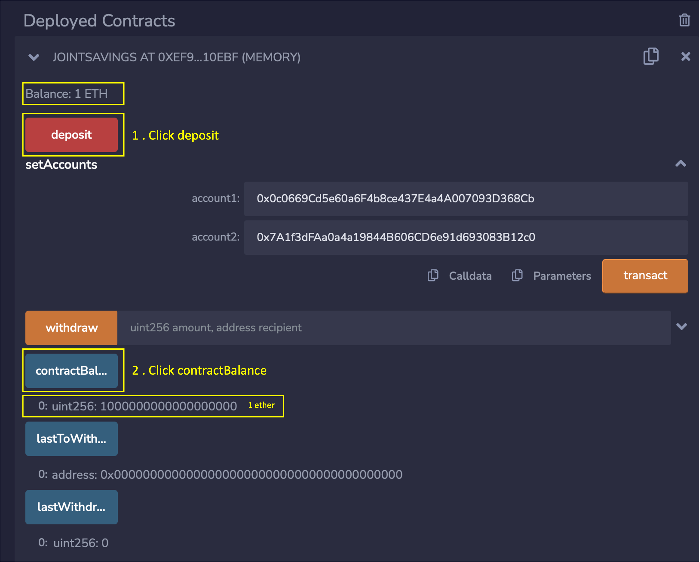
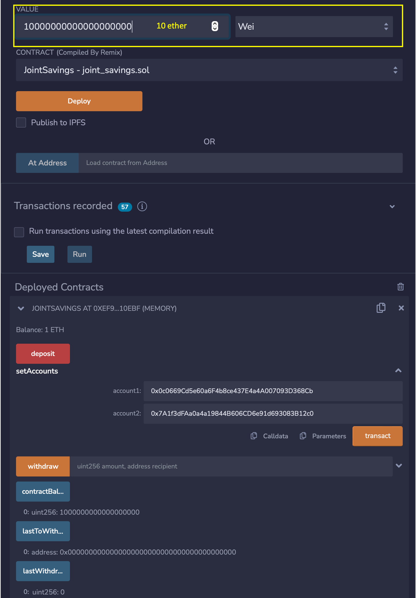
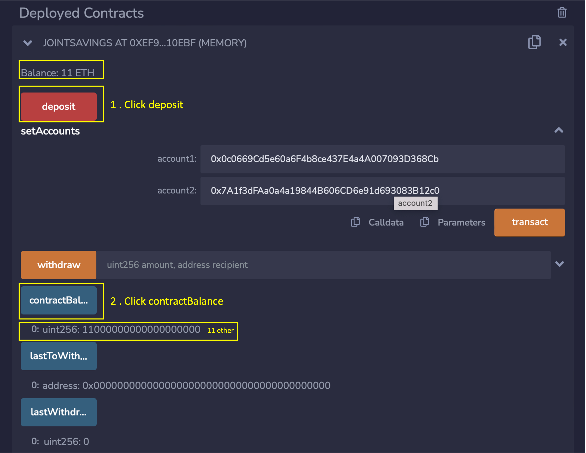
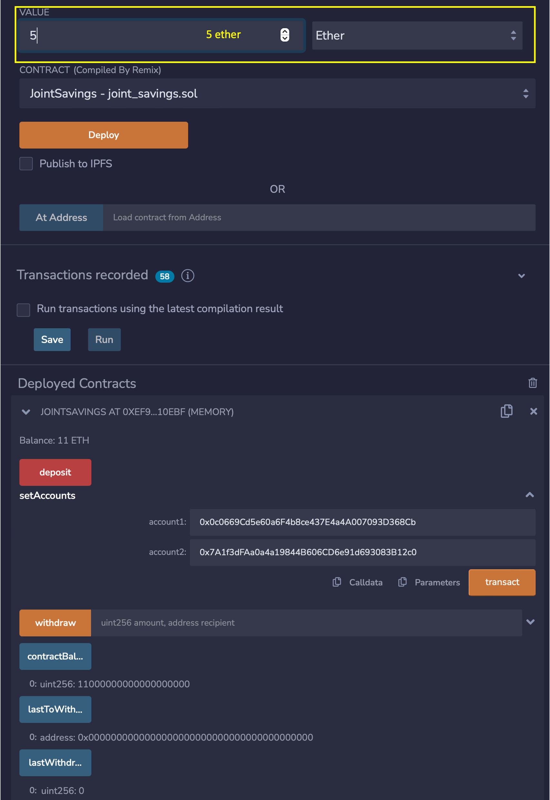
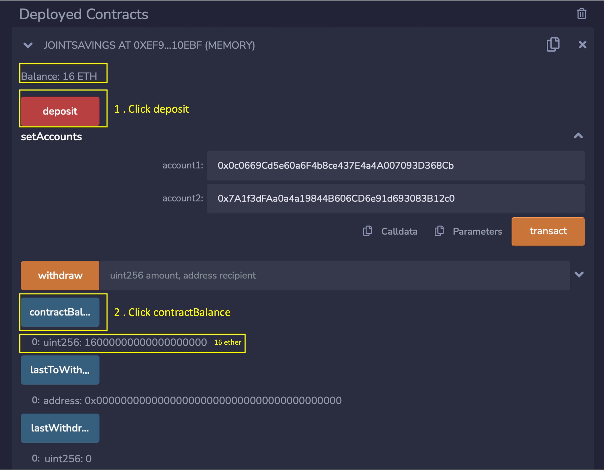
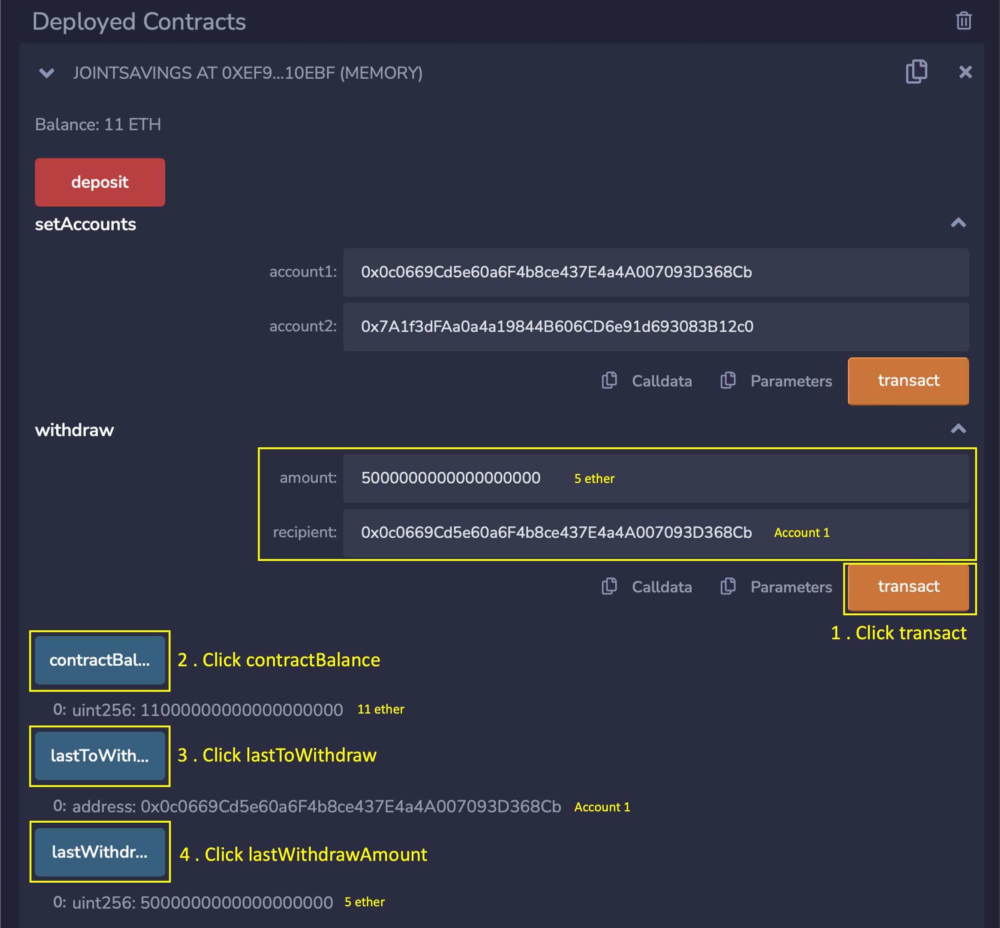

# Joint Savings Account Contract in Solidity

Create a solidity smart contract that accepts two user addresses that are then able to control a joint savings account in a financial institution. The smart contract uses ether management functions to implement various requirements from a financial institution to provide the features of the joint savings account.

 

----

## Technologies

This application uses the following technologies:

* [Remix](https://remix.ethereum.org)

 

---

## Usage

Got to the Remix website, create a new smart contract and copy/paste the code from the joint_savings.sol file. Compile and deploy the joint_savings.sol smart contract in Remix.

The following images showed the tests done on the smart contract.

 

1. Assign the two account Ethereum addresses. Dummy addresses can be obtained using the Ethereum vanity address generator on the [Vanity-ETH](https://vanity-eth.tk)  website.

 

2. Deposit 1 ether as wei.

 

3. Screen showing contract balance (savings account balance) after deposit is made

 

4. Deposit 10 ether as wei.

 

5. Screen showing contract balance (savings account balance) after deposit is made

 

6. Deposit 5 ether as wei.

 

7. Screen showing contract balance (savings account balance) after deposit is made

 

8. Screen showing contract balance (savings account balance) after a 5 ether is withdrawal is made by Account 1

 

9. Screen showing contract balance (savings account balance) after a 10 ether is withdrawal is made by Account 2

 

---

## Contributors

This application is written by James Tan, with code snippets provided UBC Extension.

 

---

## License

MIT.